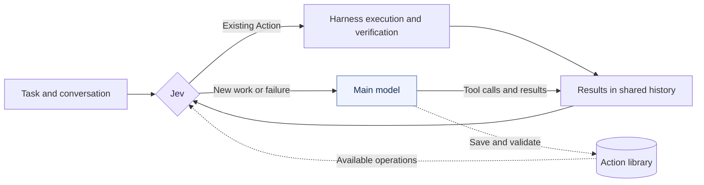

<p align="center">
  
</p>

<h1 align="center">JevDo</h1>

<p align="center"><strong>The model is a tool now.</strong></p>
<p align="center">
  A new harness architecture with Jev at its core.<br>
  Actions preserve experience · Jev decides what comes next · The main model is one option
</p>
<p align="center"><em>Just Jev it.</em></p>

<p align="center">
  <a href="LICENSE"></a>
  <a href="docs/REFERENCE.md"></a>
  <a href="package.json"></a>
</p>

<p align="center">
  <a href="README.md">简体中文</a> · <b>English</b>
</p>
<p align="center">
  <a href="#the-handoff-in-practice">Use cases</a> · <a href="#quick-start">Quick start</a> · <a href="#the-loop">The loop</a> · <a href="#early-results">Results</a> · <a href="CONTRIBUTING.en.md">Contributing</a>
</p>

**Why think through an operation you already know how to do?** Read the config, find the script, assemble the command, inspect the result. JevDo asks a question before calling the main model: do we already know how to do this? Jev selects reusable operations when they fit and calls the main model for new work. As that model solves problems, it saves suitable operations as verified **Actions**, ready for another session.

## The handoff in practice

Three illustrative workflows, assuming the project already has the corresponding validated Actions.

**① Fix a bug**

“Start the backend, fix the order-list pagination bug, then run unit tests and build.”

```text
Jev    Start dependencies and services; check readiness  [start-admin-backend]
  ↓
Model  Read the issue, locate and fix the pagination bug
  ↓
Jev    Test, build, verify exit codes and artifacts      [test-and-build]
  ↓
Model  Explain the fix and verification results
```

**② Fix a failing CI check**

“CI lint failed again. Reproduce it locally, fix it, and verify it passes.”

```text
Jev    Prepare dependencies; reproduce lint with CI config  [repro-ci-lint]
  ↓
Model  Fix the reported errors
  ↓
Jev    Rerun lint and pre-push checks                       [verify-before-push]
  ↓
Model  Explain the changes and suggest a commit message
```

**③ Prepare a release**

“Run the release workflow: version, changelog, tag, and build artifacts.”

```text
Jev    Run regression tests; check release conditions    [regression-gate]
  ↓
Model  Review merged changes; update version and CHANGELOG
  ↓
Jev    Run the project script to tag, build, and verify   [cut-release]
  ↓
Model  Draft the release notes
```

**Jev schedules repeatable operations; the main model handles new problems.** A full start → code edit → test/build handoff has [run in our experiments](reports/developer-workflows-v3/ANALYSIS.md). When existing Actions cover the entire request and completion checks pass, Jev can finish requests such as “start the project” or “run regression tests” with **zero main-model calls**.

## The loop

- **Jev decides what happens next.** It receives the same assembled conversation and tool history as the main model, then selects an Action, a model call, clarification, or completion.
- **Actions preserve how to act.** A command or script, its purpose, project binding, and verifier. Simple commands stay simple; complex repeatable workflows are usually better kept in scripts.
- **The main model solves new problems and maintains the library.** It writes code, reasons, handles failures, and saves reusable operations while working.

> Built on DeepSeek Harness. Early release, focused on headless DSH 0.2.0-rc.1. Package and tool names retain `jevaction`. Once the main model participates, it owns the final response.



Jev selects; code executes. Candidates have registered IDs and concrete parameter sources. Commands still pass through host permissions and verification. Missing bindings, changed implementations, and execution failures return control to the main model.

## Learning an Action

The main model inspects the project, saves an operation through `jevaction_create`, and validates it through `jevaction_validate`. The plugin supplies authoring guidance automatically, including proactive maintenance and explicit user requests not to save.

In another session, Jev selects the Action and project. The harness fills in the stored execution parameters, runs the operation, and checks its effect. A successful operation may still leave reasoning or editing work for the main model.

Action definitions, project bindings, implementation fingerprints, and validation receipts are persisted separately. Implementation changes require revalidation; ordinary input changes are handled by effect verification. See the [specification](docs/ACTION_SPEC.md) and [usage guide](docs/ACTION_USAGE.md) (Chinese).

## Early results

We compare JevDo with the native DSH loop across three common development workflows: **project startup, testing and building, and local publishing**. All arms receive the same existing scripts. Action libraries started empty in the original experiment; the native DSH loop runs each task once, while JevDo uses fresh sessions and identical inputs across three rounds, retaining its library.

| Per three tasks | Native loop | JevDo round 1 (learning) | Round 2 | Round 3 |
|---|---:|---:|---:|---:|
| Tasks passing verification | 3/3 | 3/3 | **3/3** | **3/3** |
| Main-model calls | 24 | 22 | **0** | **0** |
| Tasks without a main-model call | 0/3 | 0/3 | **3/3** | **3/3** |
| Jev calls | 0 | 56 | 20 | 15 |
| Mean duration | 10.06 s | 19.36 s | **3.61 s** | **3.17 s** |
| Estimated cost, including Jev | CNY 0.2245 | CNY 0.6065 | **CNY 0.0828** | **CNY 0.0587** |
| Cost reduction vs. native | — | — | **63.14%** | **73.86%** |

These are the autonomous-save results. **Both reuse rounds require zero main-model calls, with a 68.50% average estimated cost reduction against the same native tasks.** This reduction excludes initial learning: all three rounds total CNY 0.7480, still 11.04% above three times the measured native round. Costs include Jev at fixed accounting rates, not actual invoices.

This is a post-hoc three-task subset of a small, single-rollout experiment, not a new run or a public benchmark. Original data is unchanged; the four-task 31 → 8 calls (~74% reduction) and rollback records remain in the historical report. [Final three-task results](reports/developer-workflows-v3/FINAL_RESULTS.md) · [Cost breakdown](reports/developer-workflows-v3/COST_BREAKDOWN.md) · [Original four-task report](reports/developer-workflows-v3/REPORT.md) · [Raw traces](reports/developer-workflows-v3/traces)

## Quick start

Requires **Node.js 24.14+**. Try persistent Action reuse without API keys:

```bash
git clone https://github.com/yinhong-zhou/jevdo.git
cd jevdo
npm ci
npm run demo
```

For live Jev calls, configure `TYPESAFE_API_KEY`. The experimental CLI also reads the main-model configuration in `.env.example`; a native DSH installation uses its host's model configuration. Build with `npm run build`, then follow the [DSH installation and configuration reference](docs/REFERENCE.md) (Chinese).

## Development

Action examples, reproductions, loop fixes and documentation improvements are welcome. See the [contribution guide](CONTRIBUTING.en.md) for development conventions and working with upstream projects.

```bash
npm run check
npm test
npm run build
```

Learned recipes currently use fixed commands and project bindings. Arbitrary learned parameters, full Web UI compatibility, and multi-agent plugin combinations are outside the verified scope. Start at [src/dsh/index.ts](src/dsh/index.ts). [Report an issue](https://github.com/yinhong-zhou/jevdo/issues).

## License and credits

MIT. Thanks to the authors and contributors of [DeepSeek Harness](https://github.com/deepseek-ai/deepseek-harness) for the plugin and agent runtime foundation. This project adapts its official loop lifecycle; copyright and provenance remain in [THIRD_PARTY_NOTICES.md](THIRD_PARTY_NOTICES.md) and the [vendored loop](src/vendor/dsh-loop).
