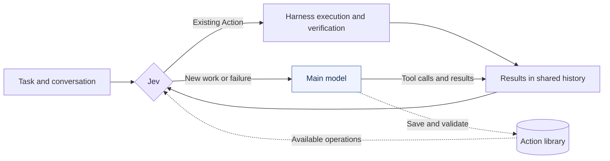

<p align="center">
  
</p>

<h1 align="center">JevDo</h1>

<p align="center"><strong>The model is a tool now.</strong></p>
<p align="center">
  A new harness architecture with Jev at its core.<br>
  Actions preserve experience · Jev decides what comes next · The main model is one option
</p>
<p align="center"><em>Just Jev it.</em></p>

<p align="center">
  <a href="LICENSE"></a>
  <a href="docs/REFERENCE.md"></a>
  <a href="package.json"></a>
</p>

<p align="center">
  <a href="README.md">简体中文</a> · <b>English</b>
</p>
<p align="center">
  <a href="#quick-start">Quick start</a> · <a href="#the-loop">The loop</a> · <a href="#early-results">Results</a> · <a href="docs/ACTION_SPEC.md">Action specification</a>
</p>

**Your agent can write the application. Tomorrow, it may still have to rediscover how to start it.** Read the config, find the script, assemble the command, inspect the result. JevDo asks a question before calling the main model: do we already know how to do this? Jev selects reusable operations when they fit and calls the main model for new work. As that model solves problems, it saves suitable operations as verified **Actions**, ready for another session.

- **Jev decides what happens next.** It receives the same assembled conversation and tool history as the main model, then selects an Action, a model call, clarification, or completion.
- **Actions preserve how to act.** A command or script, its purpose, project binding, and verifier. Simple commands stay simple; complex repeatable workflows are usually better kept in scripts.
- **The main model solves new problems and maintains the library.** It writes code, reasons, handles failures, and saves reusable operations while working.

> Built on DeepSeek Harness. Early release, focused on headless DSH 0.2.0-rc.1. Package and tool names retain `jevaction`. Action-only requests can finish without a main-model call; once the main model participates, it owns the final response.

## The loop



Jev selects; code executes. Candidates have registered IDs and concrete parameter sources. Commands still pass through host permissions and verification. Missing bindings, changed implementations, and execution failures return control to the main model.

With the relevant Actions in place, a request such as “start the project, add a function, then test and build” can take this path:

```text
Jev starts the project → model edits code → Jev tests and builds → model reports
```

This handoff has run with real Jev and main-model calls. A request covered entirely by existing Actions can complete without the main model.

## Learning an Action

The main model inspects the project, saves an operation through `jevaction_create`, and validates it through `jevaction_validate`. The plugin supplies authoring guidance automatically, including proactive maintenance and explicit user requests not to save.

In another session, Jev selects the Action and project. The harness fills in the stored execution parameters, runs the operation, and checks its effect. A successful operation may still leave reasoning or editing work for the main model.

Action definitions, project bindings, implementation fingerprints, and validation receipts are persisted separately. Implementation changes require revalidation; ordinary input changes are handled by effect verification. See the [specification](docs/ACTION_SPEC.md) and [usage guide](docs/ACTION_USAGE.md) (Chinese).

## Early results

Four repeated developer tasks: start services, test/build, publish locally, and roll back. Every arm receives the same existing scripts. Libraries start empty. The unmodified DSH loop runs each task once in the same minimal headless host. JevDo runs three rounds with identical inputs, fresh sessions, and a persistent Action library.

| Per four tasks | Native loop | JevDo round 1 | Round 2 | Round 3 |
|---|---:|---:|---:|---:|
| Main-model calls | 31 | 33 | **8** | **8** |
| Tasks without a main-model call | 0/4 | 0/4 | **3/4** | **3/4** |
| Mean duration | 9.54 s | 19.52 s | 6.89 s | 6.64 s |
| Estimated cost, including Jev | CNY 0.2771 | CNY 0.8408 | CNY 0.3214 | CNY 0.3091 |

These are the autonomous-save results. Each warm round used about **74% fewer main-model calls** than the native control. The explicitly-required-save condition performed less efficiently. **Overall cost is not yet lower:** learning has a cost, and Jev also processes the complete history.

This is one rollout per condition on a small authored workload, not an official benchmark score. A Jev misselection followed by model recovery occurred; passing the final checks does not establish that every routing decision was correct. [Full report](reports/developer-workflows-v3/REPORT.md) · [Analysis](reports/developer-workflows-v3/ANALYSIS.md) · [Raw traces](reports/developer-workflows-v3/traces)

## Quick start

Requires **Node.js 24.14+**. Try persistent Action reuse without API keys:

```bash
git clone https://github.com/yinhong-zhou/jevdo.git
cd jevdo
npm ci
npm run demo
```

For live Jev calls, configure `TYPESAFE_API_KEY`. The experimental CLI also reads the main-model configuration in `.env.example`; a native DSH installation uses its host's model configuration. Build with `npm run build`, then follow the [DSH installation and configuration reference](docs/REFERENCE.md) (Chinese).

## Development

```bash
npm run check
npm test
npm run build
```

Learned recipes currently use fixed commands and project bindings. Arbitrary learned parameters, full Web UI compatibility, and multi-agent plugin combinations are outside the verified scope. Start at [src/dsh/index.ts](src/dsh/index.ts). [Report an issue](https://github.com/yinhong-zhou/jevdo/issues).

## License and credits

MIT. Built on DeepSeek Harness with an adapted copy of its official loop lifecycle. Upstream copyright and provenance are retained in [THIRD_PARTY_NOTICES.md](THIRD_PARTY_NOTICES.md) and the [vendored loop](src/vendor/dsh-loop).
