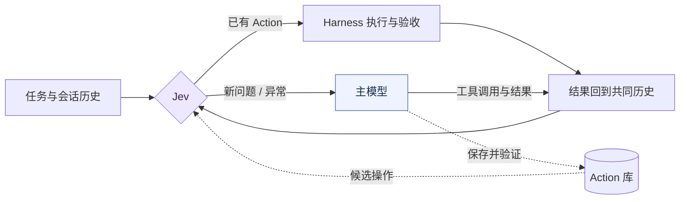

<p align="center">
  
</p>

<h1 align="center">JevDo</h1>

<p align="center"><strong>The model is a tool now.</strong></p>
<p align="center">
  以 Jev 为调度核心的新一代 harness 架构。<br>
  Action 沉淀经验 · Jev 决定下一步 · 大模型只是选项之一
</p>
<p align="center"><em>Just Jev it.</em></p>

<p align="center">
  <a href="LICENSE"></a>
  <a href="docs/REFERENCE.md"></a>
  <a href="package.json"></a>
</p>

<p align="center">
  <b>简体中文</b> · <a href="README.en.md">English</a>
</p>
<p align="center">
  <a href="#接力长什么样">使用场景</a> · <a href="#快速开始">快速开始</a> · <a href="#一轮是怎么走的">工作方式</a> · <a href="#实测">实验结果</a> · <a href="CONTRIBUTING.md">贡献指南</a>
</p>

**会做的事，为什么还要再想一遍？** 第十次打开同一个项目，它还在读配置、找脚本、拼命令，把上周已经走通的路再想一遍。JevDo 在调用大模型之前，先让 **Jev** 判断：这件事，是不是已经会了？已有操作能处理，就直接调度执行；遇到新问题，再交给主模型。主模型把值得复用的做法保存为 **Action**，经过验证，留给下一次会话。

## 接力长什么样

三个使用示例，假设项目已保存并验证了对应的 Action。

**① 日常修 bug**

“启动后台，修掉订单列表的分页 bug，跑完单测和构建再交给我。”

```text
Jev     启动依赖与服务，检查就绪           [start-admin-backend]
  ↓
主模型  读 issue，定位并修复分页逻辑
  ↓
Jev     跑单测、构建，核对退出码与产物     [test-and-build]
  ↓
主模型  说明修改与验证结果
```

**② CI 红了**

“CI 的 lint 又挂了，本地复现修一下，确认能过。”

```text
Jev     准备依赖，按 CI 配置复现 lint     [repro-ci-lint]
  ↓
主模型  根据报错修改代码
  ↓
Jev     重跑 lint，再执行提交前检查       [verify-before-push]
  ↓
主模型  解释改动，给出 commit message
```

**③ 准备发版**

“走一遍发版流程：版本号、changelog、tag、构建产物。”

```text
Jev     跑全量回归，检查发版条件          [regression-gate]
  ↓
主模型  读合并记录，更新版本号与 CHANGELOG
  ↓
Jev     按项目脚本打 tag、构建、校验产物  [cut-release]
  ↓
主模型  整理 release notes
```

**Jev 调度重复操作，主模型处理新问题。** 启动 → 代码修改 → 测试构建的完整交接已在[实验中跑通](reports/developer-workflows-v3/ANALYSIS.md)。如果请求只是“启动项目”或“跑一遍回归”，已有 Action 能覆盖全部工作且满足完成条件时，Jev 可以独立完成，**全程零次主模型调用**。

## 一轮是怎么走的

- **Jev**：决定下一步。读取与主模型相同的已组装会话和工具历史，选择 Action、请求主模型、澄清或结束本次请求。
- **Action**：留下怎么做。命令或脚本，连同用途、项目绑定和验收方式，跨会话保留；简单操作直接保存命令，复杂行为更适合脚本。
- **主模型**：解决新问题，积累新操作。写代码、做推理、处理异常，也在任务中主动维护 Action 库。

> 基于 DeepSeek Harness，早期版本优先支持 DSH 0.2.0-rc.1 的 headless 使用。包名和工具前缀保留 `jevaction`。主模型参与后，由它完成最终答复。



Jev 选择，代码执行。它只能选择当前可用的操作和参数，实际命令仍经过宿主工具权限与验收。实现发生变化、执行失败，或没有合适的操作时，工作交回主模型。

## Action 怎么留下来

第一次，主模型读取项目，找到可复用的命令或脚本，通过 `jevaction_create` 保存用途、项目绑定和验收方式，再用 `jevaction_validate` 验证并激活。它会主动考虑保存稳定的开发操作，也遵守用户“不保存”的要求。

下一次，Jev 根据当前请求选择 Action 和项目，Harness 补全已保存的执行参数，运行并验收。操作成功不等于整个任务结束：还需要分析、修改或解释，就继续调用主模型。

同一个构建 Action 可以绑定不同项目的命令。实现脚本变化后，旧版本需要复核；测试针对的源码、报表读取的数据变化，则由验收检查当前结果。完整规则见 [Action 规格](docs/ACTION_SPEC.md) 与 [使用场景](docs/ACTION_USAGE.md)。

## 实测

四个重复开发任务：启动、测试构建、本地发布、回滚。所有组获得相同的现成脚本，Action 库从空开始。原生 DSH Loop 在同一最小 headless 宿主中每个任务测一次；JevDo 重复三轮，每轮新建会话、使用相同输入，并保留 Action 库。

| 每组 4 个任务 | 原生 Loop | JevDo 第 1 轮 | 第 2 轮 | 第 3 轮 |
|---|---:|---:|---:|---:|
| 主模型调用 | 31 | 33 | **8** | **8** |
| 无需主模型的任务 | 0/4 | 0/4 | **3/4** | **3/4** |
| 平均耗时 | 9.54 s | 19.52 s | 6.89 s | 6.64 s |
| 估算费用（含 Jev） | ¥0.2771 | ¥0.8408 | ¥0.3214 | ¥0.3091 |

表中为自主保存组。后两轮的主模型调用比原生对照减少约 **74%**；明确要求保存的另一组收益较弱。**调用减少还没有转化为总体费用优势**：冷启动需要积累，完整历史的 Jev 请求也有成本。

这些是自建小样本的一次采样，不是公开基准成绩。Jev 曾误选操作，随后由主模型完成任务；最终验收通过不代表每次判断都正确。[完整报告](reports/developer-workflows-v3/REPORT.md) · [结果解释](reports/developer-workflows-v3/ANALYSIS.md) · [原始轨迹](reports/developer-workflows-v3/traces)

## 快速开始

需要 **Node.js 24.14+**。先运行不需要 API 密钥的跨会话复用演示：

```bash
git clone https://github.com/yinhong-zhou/jevdo.git
cd jevdo
npm ci
npm run demo
```

接入真实 Jev 与主模型，或替换自己的 DSH 默认 Loop，见 [安装与配置](docs/REFERENCE.md#本地准备)。插件提供 Loop、Action 工具和维护提示；实际执行继续使用宿主工具。

## 文档与开发

[配置与实现参考](docs/REFERENCE.md) · [Action 规格](docs/ACTION_SPEC.md) · [使用场景](docs/ACTION_USAGE.md) · [反馈问题](https://github.com/yinhong-zhou/jevdo/issues)

欢迎提交 Action 示例、复现用例、Loop 修复与文档改进。开发约定与上游协作方式见 [贡献指南](CONTRIBUTING.md)。

```bash
npm run check
npm test
npm run build
```

当前可学习操作以固定命令和项目绑定为主，任意自由参数、完整 Web UI 和多 Agent 组合兼容性不在已验证范围内。核心入口见 [src/dsh/index.ts](src/dsh/index.ts)，完整实现边界见 [参考文档](docs/REFERENCE.md#第一版边界)。

## 来源与协议

MIT。感谢 [DeepSeek Harness](https://github.com/deepseek-ai/deepseek-harness) 的作者与贡献者提供插件与 Agent 运行底座。本项目适配了其官方 Loop 生命周期代码，原版权与来源保留在 [第三方声明](THIRD_PARTY_NOTICES.md) 和 [适配代码](src/vendor/dsh-loop)。
