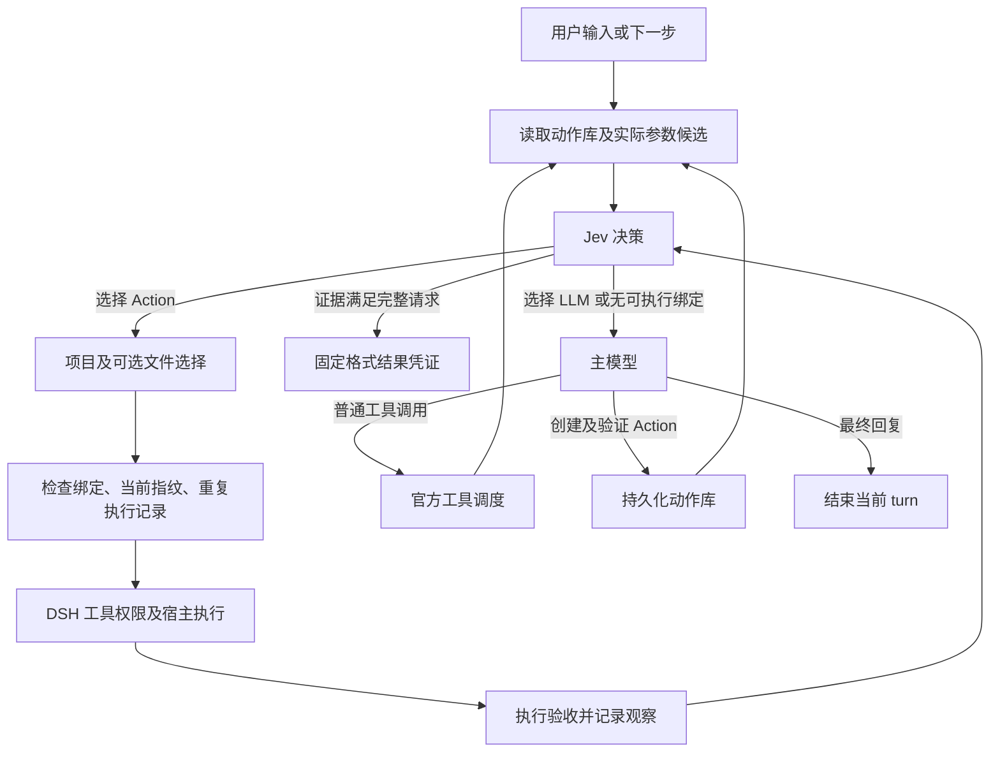

# JevAction v0.1 的元形式

Action = 用途定义 + 参数来源 + 项目绑定 + 执行步骤 + 验收条件 + 版本状态。

Action 可以是简单的命令，也可以是复杂的脚本。复杂行为更建议沉淀成脚本，但不要求每个 Action 对应一个脚本文件。沉淀的单位是一个用途明确、可以验证的可复用操作，而不是某种文件格式。

1. `Action` 描述做什么，不直接携带某个项目的路径。可学习动作的参数目前只有 project；内置 read_file 还有依赖 project 的 file 参数。
2. `Project` 提供真实目录、名称和别名。当前项目首次使用时自动登记，也可以通过 CLI 预登记其他项目。
3. `Recipe` 把 actionId 与 projectId 绑定，保存 executable、argv、cwd、timeoutMs、verify 和 watchedFiles。其他项目同名 Action 可以使用不同脚本。
4. `Receipt` 记录验证过的 recipe、实现指纹、时间和 executionId。只有已验证且指纹仍匹配的当前版本可以直接复用。
5. `Plan` 是本轮选择：actionId、projectId、可选 file、recipeId 和 fingerprint。Jev 只从当前提供的 ID 中选择；代码根据绑定补全可执行参数。

## 运行流程

## 生命周期

- 保存为 draft 不等于授权执行。validate 通常执行操作，必须属于当前已授权任务；若本轮会话中已有精确匹配的成功工具调用、步骤顺序一致且无未知修改介入，可检查当前效果并沿用该执行证据激活，不重复副作用。凭证保存匹配的 call ID。它不采信自然语言的完成声明，也不通用解析任意 shell 程序。
- 验证成功激活版本；再次保存用新 recipe ID。最新激活版本决定复用，不会静默回退到旧版本。
- 实现脚本变化后拒绝旧指纹；普通输入数据和输出文件不应默认列为 watchedFiles。
- `watchedFiles` 只登记流程实现依赖，允许为空：直接命令不需要伪造一个脚本依赖。被测试的源码、生成器读取的 schema、报表数据通常是运行输入，变化不应要求重新激活操作；verifier 检查当前输入和结果是否匹配。
- `repeatPolicy` 默认为 `once_per_request`：同一输入内同版本/同指纹 recipe 的成功凭证复用，避免重复发布等副作用。`if_not_satisfied` 适用于可安全重做的状态操作：再次被选中时先复查效果，仍满足则返回凭证，不再满足则重跑。它不自动定时运行；仍需 Jev 或主模型选择调用。并发重复调用共享一次执行，复查权限错误不会触发重跑。
- Action 执行失败后由主模型处理，Jev 不自动重试可能已经部分生效的命令。
- 第一版不会推断任意字符串、任意 shell、跨项目脚本迁移或新的候选生成代码。服务启动可调用项目自带的有限时长控制脚本，由脚本后台启动服务并返回；Loop 不自行管理任意进程。没有可落地候选就交给主模型。
- 默认采用 Jev 返回的 choice；confidence 和完整概率只用于记录分析。保留响应格式、执行权限、绑定与完成证据检查，不再用统一置信度阈值改选 LLM。

## 与宿主的关系

同一个 Cordis 插件提供 Loop、四个 Action 工具和静态 authoring prompt。保存策略是独立的 prompt 文件，入库、指纹、权限和执行逻辑由代码实现。插件卸载后移除这些贡献；磁盘 Action 库保留。

默认使用宿主已有 `pwsh` / `bash` 工具。argv 被按 shell 方言逐项引用，不进行直接字符串插值；宿主工具看到最终命令和 workdir，并执行自己的权限、沙箱和取消机制。

每一步都可以向 Jev 提问，但已有失败证据、超过本轮 Action 步数上限或决策请求失败时，代码直接交给主模型。Jev 的 DONE 还要求至少一条成功执行凭证；它仍可能误判复杂语义是否完全满足，评测不能只依赖该判断。

纯 Action 请求保留 DONE；本轮一旦出现主模型输出，后续候选不再提供 DONE，由主模型完成最终回答和必要的 Action 维护。期间 Jev 仍可选择 Action。这个规则避免主模型执行完工具后，尚未收尾或保存就被 Jev 提前结束。用户指定脚本或方法时，语义选项也必须尊重该约束，不能只比较最终状态。

Jev 使用本次主模型请求组装好的完整消息、工具定义和工具历史；Jev 的选择问题与候选列表是额外的决策信息。两者共享会话内容，不再为 Jev 单独截取最近几条消息。Action 的执行观察加入同一历史，供下一步 Jev 和主模型读取。
